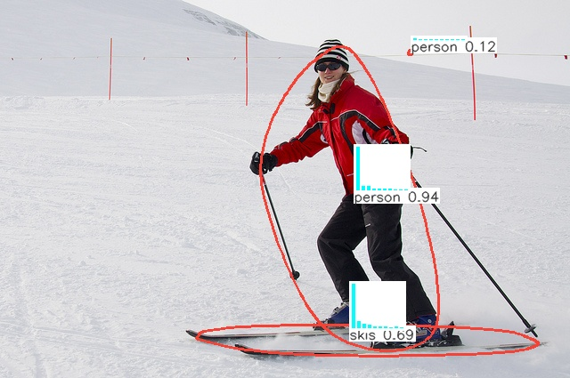

# yolov5-ft
 yolov5-ft是一个基于yolo架构的傅里叶级数目标检测，支持复杂环境下任意形状目标检测。
与传统目标检测不同的是，yolov5-ft输出目标的傅里叶级数构建的语义方程，从而更精确细致地描述目标。论文发表在
[1]Jin Liu; Zhongyuan Lu; Yaorong Cen; Hui Hu; Zhenfeng Shao; Yong Hong, Ming Jiang, Miaozhong Xu, Enhancing Object Detection With Fourier Series, IEEE Transactions on Pattern Analysis and Machine Intelligence, 08 January 2025, pp1-17, Print ISSN: 0162-8828, CD:2160-9292, ISSN:1939-3539, DOI: 10.1109/TPAMI.2025.3526990
https://ieeexplore.ieee.org/document/10833868

您可以通过以下信息引用：
```bibtex
@article{greenwade93,
    author  = "Jin Liu; Zhongyuan Lu; Yaorong Cen; Hui Hu; Zhenfeng Shao; Yong Hong, Ming Jiang, Miaozhong Xu",
    title   = "Enhancing Object Detection With Fourier Series",
    year    = "2005",
    journal = "IEEE Transactions on Pattern Analysis and Machine Intelligence",
    DOI = 10.1109/TPAMI.2025.3526990
    pages   = "1-17"
}

### 推理可视化
以下是coco2017数据集模型推理视频展示：


Rotated Object Detection Demos


以下是几张推理可视化图片：



??????这里给出4个模型下载链接
coco2017模型下载链接
dota1.5模型下载链接
hrsc2016模型下载链接
UCAS模型下载链接

本代码是在yolov5架构基础上改进，训练和验证操作方法和模块组织架构和yolov5一致。
train.py启动训练（指出训练数据集data,模型架构cfg和预训练权重weights）
val.py启动验证（指出模型权重weights和数据集data）
detect.py启动检测图像或视频（指明模型权重weights和被检测文件夹路径source）
