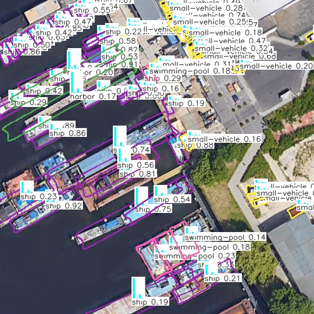

# yolov5-ft
YOLOv5-FT is a Fourier series-based object detection model built upon the YOLO architecture, designed to detect objects of arbitrary shapes in complex environments. Unlike traditional object detection, YOLOv5-FT outputs a semantic equation constructed from the Fourier series of the target, providing a more precise and detailed description of the object. The paper was published in

[1]Jin Liu; Zhongyuan Lu; Yaorong Cen; Hui Hu; Zhenfeng Shao; Yong Hong, Ming Jiang, Miaozhong Xu, Enhancing Object Detection With Fourier Series, IEEE Transactions on Pattern Analysis and Machine Intelligence, 08 January 2025, pp1-17, Print ISSN: 0162-8828, CD:2160-9292, ISSN:1939-3539, DOI: 10.1109/TPAMI.2025.3526990
https://ieeexplore.ieee.org/document/10833868

You can cite this paper as follows:
```bibtex
@article{greenwade93,
    author  = "Jin Liu; Zhongyuan Lu; Yaorong Cen; Hui Hu; Zhenfeng Shao; Yong Hong, Ming Jiang, Miaozhong Xu",
    title   = "Enhancing Object Detection With Fourier Series",
    year    = "2025",
    journal = "IEEE Transactions on Pattern Analysis and Machine Intelligence",
    DOI = 10.1109/TPAMI.2025.3526990
    pages   = "1-17"
}
```
You can contact us through:
- Tel,WeChat:13397188592
- QQEmail:41038331@qq.com

YaoRong Cen and I designed the code of this project. Thanks for everyone's contributions.

yolo-ft Object Detection Demos





### Inference Visualization
Below is a video demonstration of the model inference on the COCO 2017 dataset:
<video width="640" height="360" controls>
  <source src="https://liujin1975060601.github.io/yolov5-ft/demos/videos/road_person-cars-dog_20250206_00295546.mp4" type="video/mp4">
  你的浏览器不支持播放此视频，请<a href="https://liujin1975060601.github.io/yolov5-ft/demos/videos/road_person-cars-dog_20250206_00295546.mp4">点击这里播放视频</a>。
</video>
<video width="640" height="360" controls>
  <source src="https://liujin1975060601.github.io/yolov5-ft/demos/videos/road-cars-s_20250205_23160389_20250205_23205007.mp4" type="video/mp4">
点击链接播放演示视频，请<a href="https://liujin1975060601.github.io/yolov5-ft/demos/videos/road-cars-s_20250205_23160389_20250205_23205007.mp4">点击这里播放视频</a>。
</video>

The YOLOv5-FT model supports the following four datasets:
coco2017
dota1.5
hrsc2016
UCAS

### Instructions
This code is an improvement based on the YOLOv5 architecture, with the training and validation operations and module organization consistent with YOLOv5.
- `train.py` starts training  
  (specify the training dataset `data`, model architecture `cfg`, and pre-trained weights `weights`).

- `val.py` starts validation  
  (specify model weights `weights` and dataset `data`).

- `detect.py` starts image or video detection  
  (specify model weights `weights` and the source folder path to be detected `source`).


## Install DOTA_Devkit
If you are on Windows, please compile according to the following steps first.
```
sudo apt-get install swig
cd DOTA_devkit/polyiou
swig -c++ -python csrc/polyiou.i
python setup.py build_ext --inplace

```